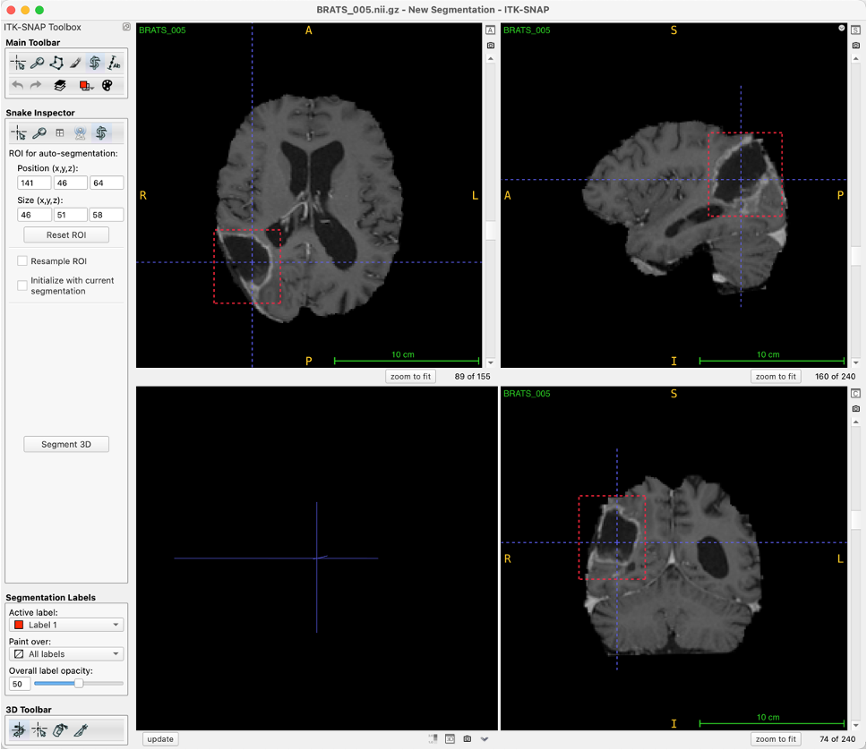

# Comparing foundation models and nnU-Net for segmentation of primary brain lymphoma on clinical routine post-contrast T1-weighted MRI


This repository contains material associated to this [paper](#Citation).

It contains:
- link to trained models for segmentation of lymphoma from post-constrast T1-weighted MRI ([link](#Trained-nnU-net-models))
- link to trained models for segmentation of enhancing tumor in MSD-BraTS datasets ([link](#Trained-nnU-net-models))
- code and material for reproducing the experiments on MSD-BraTS ([link](#Contents-for-reproducing-MSD-BraTS-experiments))

If you use this material, we would appreciate if you could cite the following reference.

## Citation
* Guanghui Fu, Lucia Nichelli, Dario Herran, Romain Valabregue, Agusti Alentorn, Khê Hoang-Xuan, Caroline Houillier, Didier Dormont, Stéphane Lehéricy, Olivier Colliot. Comparing foundation models and nnU-Net for segmentation of primary brain lymphoma on clinical routine post-contrast T1-weighted MRI. Preprint.

```
@inproceedings{fu2024comparing,
  title={Comparing foundation models and nnU-Net for segmentation of primary brain lymphoma on clinical routine post-contrast T1-weighted MRI},
  author={Fu, Guanghui and Nichelli, Lucia and Herran, Dario and Valabregue, Romain and Alentorn, Agusti and Hoang-Xuan, Khê and Houillier, Caroline and Dormont, Didier and Leh{\'e}ricy, St{\'e}phane and Colliot, Olivier},
  booktitle={Preprint},
  year={2024}
}
```
## Download and install
* **Install SAM repository:** `pip install git+https://github.com/facebookresearch/segment-anything.git`
* **Install UniverSeg repository:** `pip install git+https://github.com/JJGO/UniverSeg.git`

* **Dataset download (from medical segmentation decathlon website):** https://drive.google.com/file/d/1A2IU8Sgea1h3fYLpYtFb2v7NYdMjvEhU/view?usp=drive_link

* **Model checkpoints download**:
  Please download SAM and MedSam models from the following links, and put these checkpoints to `sam_experiment/checkpoints` path.
    1. **SAM, vit-b:** https://dl.fbaipublicfiles.com/segment_anything/sam_vit_b_01ec64.pth
    2. **SAM, vit-h:** https://dl.fbaipublicfiles.com/segment_anything/sam_vit_h_4b8939.pth
    3. **SAM, vit-l:** https://dl.fbaipublicfiles.com/segment_anything/sam_vit_l_0b3195.pth
    4. **MedSAM, vit-b:** https://drive.google.com/file/d/1UAmWL88roYR7wKlnApw5Bcuzf2iQgk6_/view?usp=drive_link

## Data split pre-processing

To be as similar as possible to lymphoma segmentation task, we selected the T1-weighted MRI after gadolinium injection and focused on the enhancing tumor as the target region. Therefore, we need some basic preprocessing to obtain T1-GD from MRI and select enhancing tumors from the label file of MSD-BraTs dataset.
* [`preprocess/main_preprocess.py`](<https://github.com/GuanghuiFU/medical_cv_foundation_eval/blob/main/preprocess/main_preprocess.py>): 
  * Split dataset
  * Get T1-GD modality from dataset
  * Binary label and get enhancing tumor
  
## Trained nnU-net models
### Lymphoma segmentation in post-contrast T1-weighted MRI 
* **Preprocessing**:
  * Resample to (1,1,1)
  * Resize to (240, 240, 160)
  * Intensity normalization to (0, 1)
* **Trained model link**: https://owncloud.icm-institute.org/index.php/s/2dPGj9hu4Jvk6Qh/download?path=%2F&files=Dataset910_Lymphoma.zip

### Enhancing tumor segmentation in MSD-BraTs datasets 
There is no preprocessing needed for using trained nnU-net model to inference on MSD-BraTS.
* **Trained model link**: https://owncloud.icm-institute.org/index.php/s/2dPGj9hu4Jvk6Qh/download?path=%2F&files=Dataset912_BRATS.zip

## Contents for reproducing MSD-BraTS experiments
We provide the following contents for reproduction of MSD-BraTS experiments:
- list of subjects of MSD-BraTS that were used ([link](<https://github.com/GuanghuiFU/medical_cv_foundation_eval/blob/main/brats-data_split.csv>))
- manual box prompts for SAM and MedSAM models ([link](#Manual-box-prompt-annotation))
- support sets for UniverSeg experiments ([link](#Support-sets-for-Universeg))
- code to train nnU-Net models ([link](#Code-to-train-nnU-net))
- code for inference of all models ([SAM/MedSAM](#Inference-for-SAM-and-MedSAM-models), [UniverSeg](#Inference-for-UniverSeg), [nnU-Net](#Inference-for-nnU-Net))
- code for computation of metrics and statistical analysis ([link](#Computation-of-metrics-and-statistical-analysis))
- Note that, here train means train/validation for nnU-Net.


## Manual box prompt annotation

SAM and MedSAM require prompts. In this paper, we drew box prompts manually.

The figure below shows our process of using ITK-SNAP for drawing box prompts.

We also provide screen recording videos during annotation: https://owncloud.icm-institute.org/index.php/s/9LWatZ2xDB9SvE0



In order to reproduce the experiments, you need the coordinates of the box prompts which are given here:
* [`sam_experiment/brats_prompt/3d_manual.csv`](<https://github.com/GuanghuiFU/medical_cv_foundation_eval/blob/main/sam_experiment/brats_prompt/3d_manual.csv>): The manual annotate box prompt in 3D level

## Generating boxes from grount truth
Also we provide the prompts generated from ground-truth.
* [`sam_experiment/brats_prompt/3d_gt.csv`](<https://github.com/GuanghuiFU/medical_cv_foundation_eval/blob/main/sam_experiment/brats_prompt/3d_gt.csv>): The box prompt generate from ground truth in 3D level. 
* [`sam_experiment/brats_prompt/2d_gt`](<https://github.com/GuanghuiFU/medical_cv_foundation_eval/tree/main/sam_experiment/brats_prompt/2d_gt>): The box prompt generate from ground truth in 2D level

The code to generate the boxes from ground truth is provided here:

* [`sam_experiment/label2box_3d.py`](<https://github.com/GuanghuiFU/medical_cv_foundation_eval/blob/main/sam_experiment/label2box_3d.py>): The code to generate box prompt from ground truth in 3D level.
* [`sam_experiment/label2box_2d.py`](<https://github.com/GuanghuiFU/medical_cv_foundation_eval/blob/main/sam_experiment/label2box_2d.py>): The code to generate box prompt from ground truth in 2D slice level.


## Support sets for Universeg

The different support sets are given here:  [`brats_support_set.zip`](<https://github.com/GuanghuiFU/medical_cv_foundation_eval/blob/main/brats_support_set.zip>) 

The code to build the support sets:
* [`universeg_experiment/universeg_select_support_set.py`](<https://github.com/GuanghuiFU/medical_cv_foundation_eval/blob/main/universeg_experiment/universeg_select_support_set.py>): this code offers strategies for selecting the support set, a crucial step in preparing data for the UniverSeg [2] model. It includes options to select slices based on their size (largest, smallest, or medium). 

## Code to train nnU-net

Training nnU-Net only requires the following commands. `DATASET_ID` and `FOLD` are defined in the same way as [nnU-net official codes](<https://github.com/MIC-DKFZ/nnUNet>). See the [official code](<https://github.com/MIC-DKFZ/nnUNet>) for details.

* **Plan and preprocessing**:
```console
nnUNetv2_plan_and_preprocess -d DATASET_ID --verify_dataset_integrity
```
* **3D model training**:
```console
nnUNetv2_train DATASET_ID 3d_fullres FOLD
```
* **2D model training**:
```console
nnUNetv2_train DATASET_ID 2d FOLD
```
## Inference for SAM and MedSAM models

* [`sam_experiment/main_sam_manual_prompt.py`](<https://github.com/GuanghuiFU/medical_cv_foundation_eval/blob/main/sam_experiment/main_sam_manual_prompt.py>): it can load the 3D-level manual annotate box prompt, and use SAM/MedSAM to inference.
* [`sam_experiment/main_sam_gt_prompt.py`](<https://github.com/GuanghuiFU/medical_cv_foundation_eval/blob/main/sam_experiment/main_sam_gt_prompt.py>): it can load the 3D/2D level box prompt generate from ground truth, and use SAM/MedSAM to inference.

## Inference for UniverSeg
* [`universeg_experiment/main_universeg.py`](<https://github.com/GuanghuiFU/medical_cv_foundation_eval/blob/main/universeg_experiment/main_universeg.py>): it contains these three key steps:
  * Transfer data from 3d to 2D and resize to (128,128)
  * Create support set
  * Inference the UniverSeg model


## Inference for nnU-Net

Inferencing nnU-Net only requires the following commands. `DATASET_ID`, `INPUT_FOLDER` and `OUTPUT_FOLDER` are defined in the same way as [nnU-net official codes](<https://github.com/MIC-DKFZ/nnUNet>). See the [official code](<https://github.com/MIC-DKFZ/nnUNet>) for details.

* **3D inference**: 
```console
nnUNetv2_predict -d DATASET_ID -i INPUT_FOLDER -o OUTPUT_FOLDER -f  0 1 2 3 4 -tr nnUNetTrainer -c 3d_fullres -p nnUNetPlans
```
* **2D inference**:
```console
nnUNetv2_predict -d DATASET_ID -i INPUT_FOLDER -o OUTPUT_FOLDER -f  0 1 2 3 4 -tr nnUNetTrainer -c 2d -p nnUNetPlans
```
## Computation of metrics and statistical analysis

* [`evaluation/eval_bootstrap_ci.py`](<https://github.com/GuanghuiFU/medical_cv_foundation_eval/blob/main/evaluation/eval_boostrap_ci.py>): This code is for evaluation and calculate the 95% bootstrap confidence interval.
* [`evaluation/t_test.py`](<https://github.com/GuanghuiFU/medical_cv_foundation_eval/blob/main/evaluation/t_test.py>): This code is to perform paired T-test.


## Related codes

1. **SAM** [1]: https://github.com/bingogome/samm
2. **MedSAM** [5]: https://github.com/bowang-lab/MedSAM
3. **UniverSeg** [2]: https://github.com/JJGO/UniverSeg
4. **nnU-Net** [4]: https://github.com/MIC-DKFZ/nnUNet

## References

1. Alexander Kirillov, Eric Mintun, Nikhila Ravi, Hanzi Mao, Chloe Rolland, Laura Gustafson, Tete Xiao, Spencer Whitehead, Alexander C Berg, Wan-Yen Lo, et al. Segment anything. In Proc. ICCV 2023, pages 4015–4026, 2023
2. Victor Ion Butoi, Jose Javier Gonzalez Ortiz, Tianyu Ma, Mert R Sabuncu, John Guttag, and Adrian V Dalca. UniverSeg: Universal medical image segmentation. In Proc. ICCV 2023, pages 21438–21451, 2023.
3. Michela Antonelli, Annika Reinke, Spyridon Bakas, Keyvan Farahani, Annette Kopp-Schneider, Bennett A Landman, Geert Litjens, Bjoern Menze, Olaf Ronneberger, Ronald M Summers, et al. The medical segmentation decathlon. Nature communications, 13(1):4128, 2022.
4. Fabian Isensee, Paul F Jaeger, Simon AA Kohl, Jens Petersen, and Klaus H Maier-Hein. nnU-Net: a self-configuring method for deep learning-based biomedical image segmentation. Nature methods, 18(2):203–211, 2021.
5. Ma, Jun, et al. "Segment anything in medical images." *Nature Communications* 15.1 (2024): 654.
